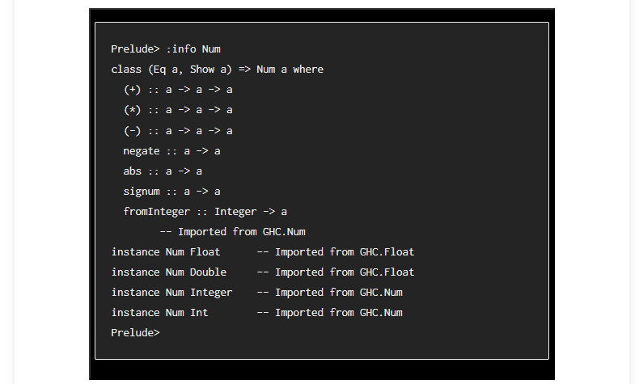
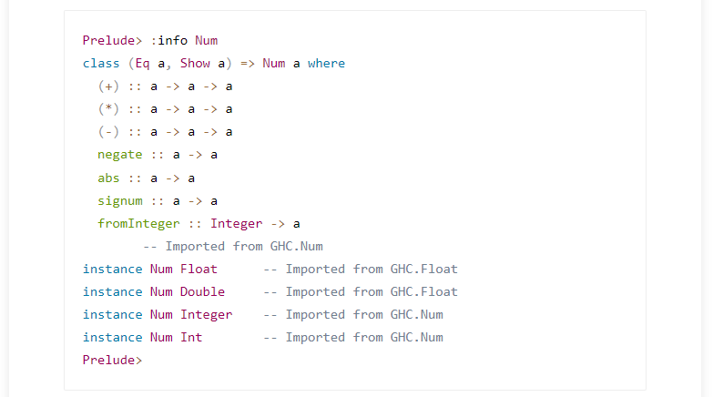
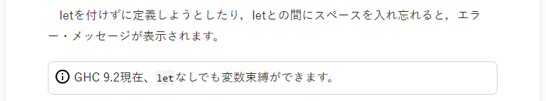

# 「Better 『本物のプログラマはHaskellを使う』」Chrome 拡張

## 動機

日経クロステックに『[本物のプログラマは Haskell を使う](https://xtech.nikkei.com/it/article/COLUMN/20060915/248215/)』というすばらしい記事があるのですが2006年から2013年の連載のため2022年現在ではいくか古い情報が見られます。

この連載を改訂できればよいのですが権利がないため Chrome 拡張として作成して補完しようと思いました。

## 機能

- シンタックスハイライト
  - ブロック
  - インライン
- 注釈の挿入

### シンタックスハイライト

コードブロックを自動的に認識して [Prism.js](https://prismjs.com/) でシンタックスハイライトをする。

| 拡張なし | 拡張あり |
|:---:|:---:|
|  |  |

インラインコードは設定ファイルの指示により等幅フォントにされシンタックスハイライトされる。

| 拡張なし | 拡張あり |
|:---:|:---:|
|  |  |

### 注釈の挿入

古くなった内容に対して注釈をする。設定ファイルで指示される。



## 開発

### ファイル構成

ファイル構成は下記の通り。

- _manifest.json_ &mdash; Chrome 拡張用のメタデータを格納したファイル
- _content.js_ &mdash; プログラムソースはこれだけ
- _content.css_ &mdash; 挿入するスタイルシート
- _config.json_ &mdash; _content.js_ がこれにしたがって動作する

### 設定ファイル

_config.json_ の文法の説明をする。小文字で書いた部分はキーワードで大文字で書いた部分は変数である。

```js
{
  PAGE_ID: { // どのページに対してか
    "inline": {
      SELECTOR_QUERY: [ // どのブロックエレメントに対してか
        {
          "begin": BEGIN, // どこから
          "end": END, // どこまで
          "tag": TAG, // 何を
          "attributes": {
            ATTRIBUTE_NAME: ATTRIBUTE_VALUE
          }
        }
      ]
    },
    "block": {
      POSITION: BLOCK // どこに何を
    }
  }
}
```

| 変数 | 説明 |
|:---:|:---|
| `PAGE_ID` | ページ識別子となる文字列。例えば `https://xtech.nikkei.com/it/article/COLUMN/20060905/247156/` だと `20060905/247156` が `PAGE_ID` となる。 |
| `SELECTOR_QUERY` | インラインタグを挿入するブロックエレメントを指定するクエリーとなる文字列。妥当な CSS セレクターである。 |
| `BEGIN` | 開始インラインタグを挿入する位置を表わす自然数の数値。 |
| `END` | 終了インラインタグを挿入する位置を表わす自然数の数値。 |
| `TAG` | 挿入するタグ名を表わす文字列。 |
| `ATTRIBUTE_NAME` | 挿入する属性名を表わす文字列。 |
| `ATTRIBUTE_VALUE` | 挿入する属性値を表わす文字列。 |
| `POSITION` | ブロックエレメントを挿入する位置を表わす自然数の文字列。 |
| `BLOCK` | 挿入するブロックエレメントを表わす文字列。 |

### 挿入位置

挿入位置を表わす数値は次のように決まる。

要素がn個の要素列があるとき、それぞれの要素の間に対して先頭から0からn-1までのインデックスを振る。先頭の要素の前に0、後尾の要素の後ろにnのインデックスを振る。

例えば `Abcdefg` という文字列があるとき、0から7までの整数xに対してxの位置に文字xを挿入すると `0A1b2c3d4e5f6g7` となる。

```
 A b c d e f g
0 1 2 3 4 5 6 7
```

### コマンド

拡張に同梱されたファイルを参照するには Chrome が決めるプレフィックスが必要となる。これは事前には分からず、こういった問題を解結するために「コマンド」がある。

例えば `class` 属性に次のような文字列を指定する。

```
real-haskeller_src=asset:icon/information-outline.svg
```

これは、この `class` 属性のあるエレメントと同じエレメントに `src` 属性を追加し、`icon/information-outline.svg` に先述のプレフィックスを付加した文字列を `src` 属性の値とする。

つまり下記の1つめの HTML が2つめのように変換される（実際には `class` はそのまま残る）。

```html


```
